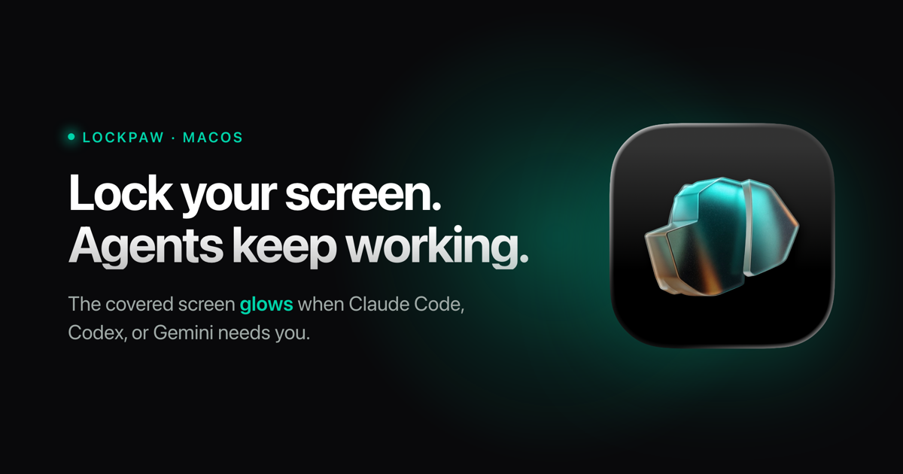

<p align="center">
  
</p>

<h1 align="center">Lockpaw</h1>

<p align="center">
  <strong>One hotkey covers your screen. One hotkey uncovers it. Everything keeps running.</strong><br>
  <em>No sleep. No display disconnect. No process interruption. The screen glows when your agent needs you.</em>
</p>

<p align="center">
  <a href="https://getlockpaw.com"></a>
  <a href="https://github.com/sorkila/lockpaw/actions/workflows/ci.yml"></a>
  <a href="https://github.com/sorkila/lockpaw/releases/latest"></a>
  
  
  
  
</p>

<p align="center">
  
</p>

---

> You could set up Amphetamine, configure Hot Corners, tweak energy settings, and adjust your screen saver. Or you could press ⌘⇧L.

## Features

- ⌨️ **One hotkey** — lock and unlock with ⌘⇧L (customizable)
- 🔒 **Touch ID unlock** — or password fallback, just like your Mac
- 🖥️ **Every screen covered** — all displays, auto-detects new monitors
- 🤖 **Agents keep running** — AI coding tools, builds, downloads, SSH sessions
- 🔔 **Agent alerts** — the locked screen glows when Claude Code, Codex, or Gemini needs you
- 😴 **Prevents sleep** — IOKit assertion keeps your Mac awake while locked
- 📦 **10 MB** — native Swift, no Electron
- 🚫 **No analytics** — no data leaves your Mac, no accounts; the only network call is the signed update check
- 🐕🐈 **Dog or cat mode** — choose the metallic origami dog or cat for the lock screen
- ⚙️ **Native Settings** — lock screen, shortcuts, updates, permissions, and about in one quiet window

<br>

## Usage

| Action | How |
|--------|-----|
| Lock | Your hotkey (default `Cmd+Shift+L`) |
| Quick unlock | Same hotkey |
| Fallback unlock | Click *Authenticate with Touch ID* at the bottom of the lock screen |
| Settings | Menu bar → Settings… |
| Change hotkey | Settings → Shortcuts → click to record |
| Change mascot | Settings → Lock Screen → Mascot |

<br>

## Agent alerts

Lock your screen and walk away — when your AI agent pauses for permission or finishes,
the locked screen **glows from across the room** and a notification fires. You stay
covered (and private) until *you* unlock. The glow is always silent; turn on a sound in
**Settings → General** if you want one (off by default for shared offices).

**Easiest:** open **Settings → General → Connect your agent** and click your agent —
done. Prefer the terminal? Lockpaw ships a tiny `lockpaw` command-line tool
(`Lockpaw.app/Contents/SharedSupport/lockpaw`); one command wires everything up,
including installing itself into `~/.local/bin` (add `--print` to just see the snippet):

| Agent | Setup | What it hooks |
|-------|-------|---------------|
| **Claude Code** | `lockpaw install-hook claude` | `Notification` + `Stop` hooks in `~/.claude/settings.json` (honors `$CLAUDE_CONFIG_DIR`) |
| **Codex CLI** | `lockpaw install-hook codex` | `notify` in `~/.codex/config.toml` |
| **Gemini CLI** | `lockpaw install-hook gemini` | prints a hook snippet for `~/.gemini/settings.json` |
| **Anything else** | append `; lockpaw ping` to your command | runs after your agent finishes |

The hooks reference `~/.local/bin/lockpaw` by path, so they work no matter what's on
your PATH, and keep working when the app moves or updates. Re-running `install-hook`
upgrades older hook entries in place; existing foreign hooks are never clobbered, and
a `.bak` backup is saved next to any config it touches. `lockpaw install-cli` is still
there if you just want the command on your PATH.

Under the hood, `lockpaw ping` posts a local notification that Lockpaw listens for — it
never launches the app if it isn't already running.

<br>

## Install

### Download

Grab the latest signed & notarized DMG from [getlockpaw.com](https://getlockpaw.com) or [GitHub Releases](https://github.com/sorkila/lockpaw/releases).

### Homebrew

```bash
brew tap sorkila/lockpaw
brew install --cask lockpaw
```

### Build from source

```bash
brew install xcodegen
git clone https://github.com/sorkila/lockpaw.git
cd lockpaw
xcodegen generate
xcodebuild -scheme Lockpaw -configuration Release build
```

On first launch, grant **Accessibility** when prompted. The Lockpaw icon appears in your menu bar.

<br>

## Design

The lock screen is intentionally minimal. Near-black canvas. Subtle radial glow. One element at a time.

**Calm by default** — the screen opens with your chosen mascot, your message, and a quiet elapsed timer; the pointer slips away after a moment of stillness. The fallback auth button waits quietly at the bottom — always there, never loud. When an agent pings, the screen breathes two slow waves of teal, then keeps a soft "your agent needs you" hint until you return.

**Mascots** — a metallic origami dog or cat rendered in teal and amber, floating in a pool of light. Slow 12-second breathing cycle. On successful unlock, the mascot scales up with a teal bloom and fades away.

**Typography** — system San Francisco throughout. Regular weight message at 55% white. Monospaced timer at 35%. The screen whispers.

**Auth button** — glass material effect with a subtle border. Visible enough to be tappable, quiet enough to stay out of the way.

<br>

## Under the hood

**Hotkey** — `CGEvent.tapCreate` with `.listenOnly` on a dedicated background thread. Bypasses the LSUIElement activation issue that affects Carbon hotkeys in menu bar apps. Requires Accessibility permission.

**Input blocking** — separate `CGEventTap` intercepts all keyboard, scroll, and tablet events system-wide while locked. Mouse events pass through to the overlay (SwiftUI buttons need clicks). If macOS disables the tap, it re-enables synchronously in the callback.

**Window level** — `CGShieldingWindowLevel()`, the highest level in the system. Above Spotlight, Notification Center, screen savers, everything.

**Multi-display** — one overlay window per screen, recreated on hot-plug.

**State machine** — `LockState` enum with validated transitions. Every `transitionTo()` call is checked. State is verified again after async authentication returns.

**Sleep prevention** — `IOPMAssertion` keeps the Mac awake while locked.

**Auth** — `LAContext.evaluatePolicy(.deviceOwnerAuthentication)` for Touch ID with password fallback. Rate-limited: 30s cooldown after 3 failed attempts.

**Auto-updates** — Sparkle framework checks for updates automatically. Appcast hosted at getlockpaw.com.

<br>

## Security model

Lockpaw is a **visual privacy tool**, not a security boundary.

It guards against the accidental — a colleague, a cat, your own muscle memory while agents run. Not the intentional.

<details>
<summary><strong>What it does</strong></summary>
<br>

- Overlay at highest system window level
- Event tap blocks all keyboard/scroll input
- Fast User Switching cancels auth, keeps lock active
- Accessibility revocation detected and handled (force unlock with warning)
- URL scheme rate-limited (100ms debounce)
- Debug escape hatch compile-gated (`#if DEBUG`)
- State machine validates every transition
- Hotkey conflict detection against system shortcuts

</details>

<details>
<summary><strong>What it doesn't do</strong></summary>
<br>

- Prevent `pkill Lockpaw`
- Block synthetic events (AppleScript, Accessibility API)
- Survive kernel-level access
- Protect against screen recording during overlay fade-in

For real security: `Ctrl+Cmd+Q`.

</details>

Found a lock or auth bypass anyway? Please [report it privately](SECURITY.md).

<br>

## URL scheme

```
lockpaw://lock              Lock the screen
lockpaw://unlock            Unlock with Touch ID
lockpaw://unlock-password   Unlock with password
lockpaw://toggle            Toggle lock state
```

<br>

## Architecture

```
Lockpaw/
├─ LockpawApp                     Entry, MenuBarExtra, AppDelegate, onboarding
├─ Controllers/
│  ├─ LockController              State machine, lock/unlock orchestration
│  ├─ Authenticator               LAContext · Touch ID · password fallback
│  ├─ InputBlocker                CGEventTap · keyboard/scroll blocking
│  ├─ HotkeyManager               CGEventTap · global hotkey detection
│  ├─ OverlayWindowManager        NSWindow · multi-display · shielding level
│  ├─ SleepPreventer              IOKit · idle sleep assertion
│  └─ AgentNotifier               UNUserNotificationCenter · agent-ping notifications
├─ Models/
│  ├─ LockState                  .unlocked → .locking → .locked → .unlocking
│  ├─ HotkeyConfig               Centralized hotkey UserDefaults access
│  ├─ PingDecision               Pure agent-ping decision (pulse/notify/sound)
│  └─ Mascot                     Dog/cat lock screen preference
├─ Views/
│  ├─ LockScreenView             Dog/cat mascot · agent-ping glow · fallback auth
│  ├─ AmbientScreenView          Secondary display gradient animation
│  ├─ MenuBarView                Dropdown · lock/unlock/quit
│  ├─ SettingsView               Native tabs · hotkey recorder · updates
│  └─ OnboardingView             5-step wizard · hotkey · accessibility · agent alerts
├─ Utilities/
│  ├─ Constants                  Timing, animations, formatting
│  ├─ Notifications              All Notification.Name in one place
│  └─ AccessibilityChecker       AXIsProcessTrusted + System Settings
└─ Resources/
   └─ Assets                      App icon, mascot, menu bar icon, colors

LockpawCLI/
└─ main                           `lockpaw` CLI · ping · install-cli · install-hook
```

<br>

## CI

Pushes to `main` and PRs run build + 50 unit tests via GitHub Actions. Shipped DMGs are Developer ID-signed, notarized, and published to [GitHub Releases](https://github.com/sorkila/lockpaw/releases); auto-updates are delivered through Sparkle with EdDSA-signed appcasts.

<br>

---

<p align="center">
  <sub>
    <a href="https://getlockpaw.com">getlockpaw.com</a>
  </sub>
</p>

<br>
